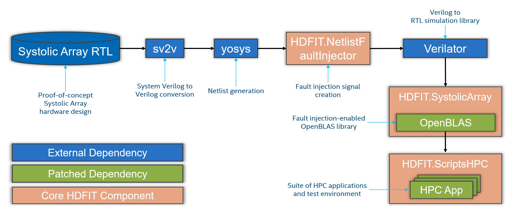

# The Hardware Design Fault Injection Toolkit (HDFIT)

``` console
This project will no longer be maintained by Intel.  
Intel has ceased development and contributions including, but not limited to,
maintenance, bug fixes, new releases, or updates, to this project.  
Intel no longer accepts patches to this project.  
If you have an ongoing need to use this project, are interested in independently
developing it, or would like to maintain patches for the open source software
community, please create your own fork of this project.
```

The Hardware Design Fault Injection Toolkit (HDFIT) enables simulation and fault injection for RTL hardware designs, allowing to perform
end-to-end experiments with numerical HPC workloads. 

## Overview

HDFIT comprises the following repositories and components:

1. [HDFIT.NetlistFaultInjector](https://github.com/IntelLabs/HDFIT.NetlistFaultInjector): a tool to add fault injection signals to an 
hardware design represented as a yosys-generated Netlist.
2. [HDFIT.SystolicArray](https://github.com/IntelLabs/HDFIT.SystolicArray): a proof-of-concept hardware design for a Systolic Array (SA) 
to carry out double-precision matrix multiplications (GEMM). The repository also contains a wrapper library to dispatch GEMM calls to the 
SA design under fault injection, as well as a git patch to integrate the former into the __OpenBLAS__ numerical library.
3. [HDFIT.ScriptsHPC](https://github.com/IntelLabs/HDFIT.ScriptsHPC): a collection of scripts to perform and evaluate fault injection 
experiments, as well as git patches to popular HPC applications for enabling HDFIT, and associated representative configurations. 

The HDFIT build system is able to retrieve dependencies automatically and apply git patches where necessary, with minimal user interaction.
For detailed build instructions, please refer to the documentation in each separate repository, starting from __HDFIT.NetlistFaultInjector__.

## HDFIT Flow

<p align="center" width="100%">
    
</p>

The image above exemplifies the overall HDFIT workflow. In more detail, it is structured as follows:

1. __Systolic Array RTL__: hardware design for the proof-of-concept double-precision SA, written in System Verilog.
2. __sv2v__: external dependency. It converts System Verilog source files to plain Verilog.
3. __yosys__: external dependency. It is used to produce a gate-level Netlist (or *techmap*) starting from the RTL SA design included with HDFIT.
4. __HDFIT.NetlistFaultInjector__: an HDFIT tool which adds fault injection signals to all gates of an input Netlist. This enables fault 
injection at all points of the hardware.
5. __Verilator__: external dependency. It is a state-of-the-art RTL simulator, used to simulate the instrumented SA Netlist.
6. __HDFIT.SystolicArray__: a wrapper library which allows to dispatch high-level GEMM calls to the simulated SA design, optionally enabling
fault injection at any of the available signals.
    * __OpenBLAS__: distributed as git patch. Modified version of the OpenBLAS numerical library which integrates the SA wrapper library. This
    allows for fault injection into BLAS GEMM calls, where one or more tiles of the output C matrices are calculated via the (faulty) simulated SA.
7. __HDFIT.ScriptsHPC__: a collection of scripts and tools to perform fault injection experiments (i.e., comprising thousands of HPC application runs),
    as well as evaluate the associated results via plots and statistics.
    * __HPC Applications__: distributed as git patches. A collection of HPC applications which make extensive use of GEMM operations, slightly altered
    to initialize HDFIT fault injection and display relevant information (e.g., GEMM operation or SA signal chosen for fault injection). A series of
    representative configurations for each HPC application are also included.

## Contributors

HDFIT has been developed at the Intel Labs Dependability Research Lab by Patrik Omland, Alessio Netti, Yang Peng, Andrea Baldovin and Michael Paulitsch.
For inquiries please contact [Patrik Omland](mailto:patrik.omland@intel.com) or [Alessio Netti](mailto:alessio.netti@intel.com).

## License Terms

All original code that is part of the HDFIT toolchain is released under the terms of the GNU Lesser General Public License (LGPL)
version 3 or (at your option) any later version. The patch files for the OpenBLAS library and the individual HPC applications,
including the associated input configurations, are instead released under the terms of the respective original licenses.
A copy of each application's license is included.

Copyright (c) 2022, Intel Corporation. All rights reserved.
